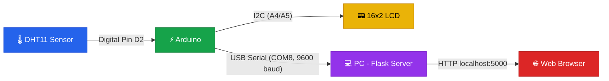

# 🔌 Arduino Temperature Dashboard — Wiring Mapping

> [!NOTE]
> This document maps every hardware connection for the **DHT11 + I2C LCD + Flask Web Dashboard** project.

---

## 📋 Components List

| # | Component | Description |
|---|-----------|-------------|
| 1 | **Arduino Uno / Nano** | Microcontroller board |
| 2 | **DHT11** | Temperature & Humidity sensor |
| 3 | **16×2 LCD (I2C)** | Display with PCF8574 I2C backpack (address `0x27`) |
| 4 | **USB Cable** | Serial communication to PC (`COM8` @ 9600 baud) |
| 5 | **Breadboard + Jumper Wires** | For prototyping connections |

---

## 🔗 Wiring Diagram

### DHT11 Sensor → Arduino

| DHT11 Pin | Arduino Pin | Notes |
|-----------|-------------|-------|
| **VCC** (+) | **5V** | Power supply |
| **DATA** (S) | **D2** | Digital pin 2 (`DHTPIN 2` in code) |
| **GND** (−) | **GND** | Ground |

> [!TIP]
> If you're using a **bare DHT11 (4-pin)**, add a **10kΩ pull-up resistor** between the DATA pin and VCC. If you're using a **3-pin DHT11 module** (on a breakout board), the resistor is already built-in.

---

### I2C LCD (16×2) → Arduino

| LCD I2C Pin | Arduino Pin | Notes |
|-------------|-------------|-------|
| **GND** | **GND** | Ground |
| **VCC** | **5V** | Power supply |
| **SDA** | **A4** | I2C Data (Uno/Nano default) |
| **SCL** | **A5** | I2C Clock (Uno/Nano default) |

> [!IMPORTANT]
> The I2C address is set to **`0x27`** in the code. If your LCD doesn't display anything, run an [I2C Scanner sketch](https://playground.arduino.cc/Main/I2cScanner/) to find the correct address — some modules use `0x3F` instead.

---

### Arduino → PC (Serial / USB)

| Connection | Details |
|------------|---------|
| **Cable** | USB Type-B (Uno) or Mini/Micro-USB (Nano) |
| **COM Port** | `COM8` (configured in `main.py` line 11) |
| **Baud Rate** | `9600` (must match in both `.ino` and `.py`) |
| **Serial Format** | `Temp:XX.XX,Hum:XX.XX` (parsed by regex in Python) |

---

## 🗺️ Pin Summary Table

```
┌─────────────────────────────────────────────┐
│              ARDUINO UNO / NANO             │
├──────────┬──────────────────────────────────┤
│  Pin     │  Connected To                    │
├──────────┼──────────────────────────────────┤
│  5V      │  DHT11 VCC  +  LCD VCC           │
│  GND     │  DHT11 GND  +  LCD GND           │
│  D2      │  DHT11 DATA pin                  │
│  A4 (SDA)│  LCD I2C SDA                     │
│  A5 (SCL)│  LCD I2C SCL                     │
│  USB     │  PC (COM8 @ 9600 baud)           │
└──────────┴──────────────────────────────────┘
```

---

## 🔄 Data Flow



---

## 📡 Serial Protocol

The Arduino sends data over serial in this exact format every **1 second**:

```
Temp:25.80,Hum:50.00
```

The Python Flask server parses it with this regex:

```python
re.search(r"Temp:([\d.]+),Hum:([\d.]+)", line)
```

| Field | Regex Group | Type | Example |
|-------|-------------|------|---------|
| Temperature | `group(1)` | `float` | `25.80` |
| Humidity | `group(2)` | `float` | `50.00` |

---

## ⚠️ Troubleshooting

| Problem | Likely Cause | Fix |
|---------|-------------|-----|
| LCD shows nothing | Wrong I2C address | Run I2C scanner, change `0x27` to detected address |
| LCD backlight on, no text | SDA/SCL swapped | Verify A4→SDA, A5→SCL |
| "Sensor Error" on LCD | DHT11 not wired correctly | Check D2 connection, add pull-up resistor |
| Python "Serial Error" | Wrong COM port | Check Device Manager → Ports, update `COM8` in `main.py` |
| Dashboard shows `--` | No serial data received | Verify baud rate is `9600` in both files |
| Garbled serial output | Baud rate mismatch | Ensure both `.ino` and `.py` use `9600` |

---

> [!CAUTION]
> **Never connect the DHT11 VCC to 3.3V** on an Arduino Uno — the DHT11 requires **5V** for reliable readings. Using 3.3V may cause intermittent `NaN` errors.

---

## 📁 Project Files Reference

| File | Purpose |
|------|---------|
| `DHT11_LCD_Web_Dashboard.ino` | Arduino sketch — reads DHT11, displays on LCD, sends serial |
| `main.py` | Flask server — reads serial, serves web dashboard |
